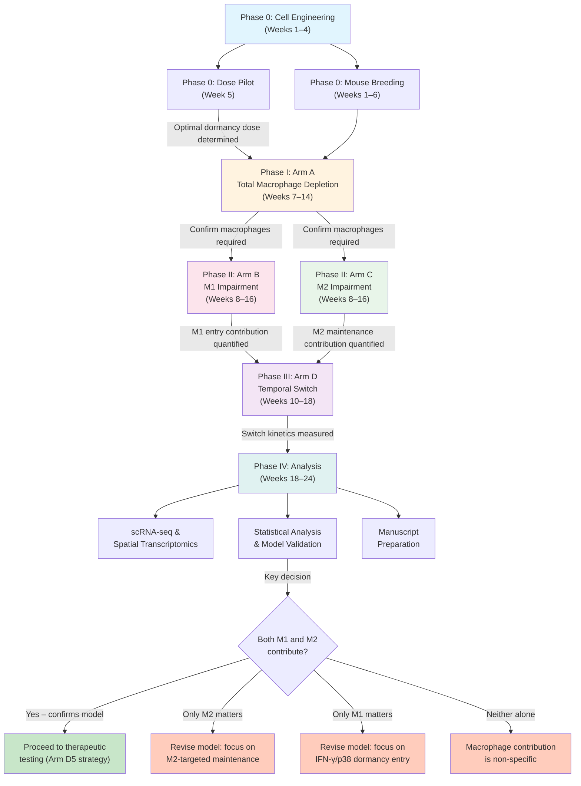
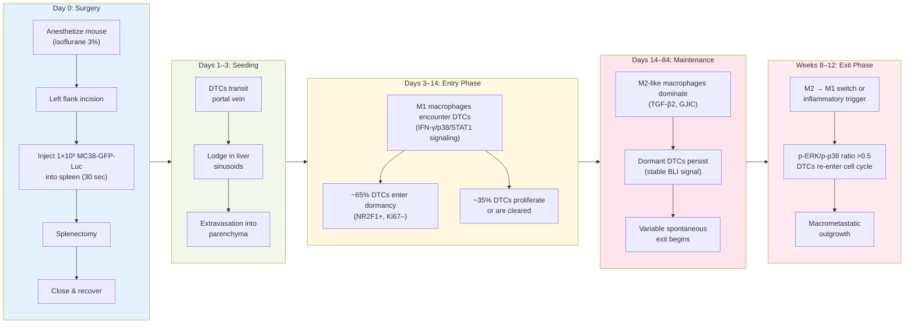
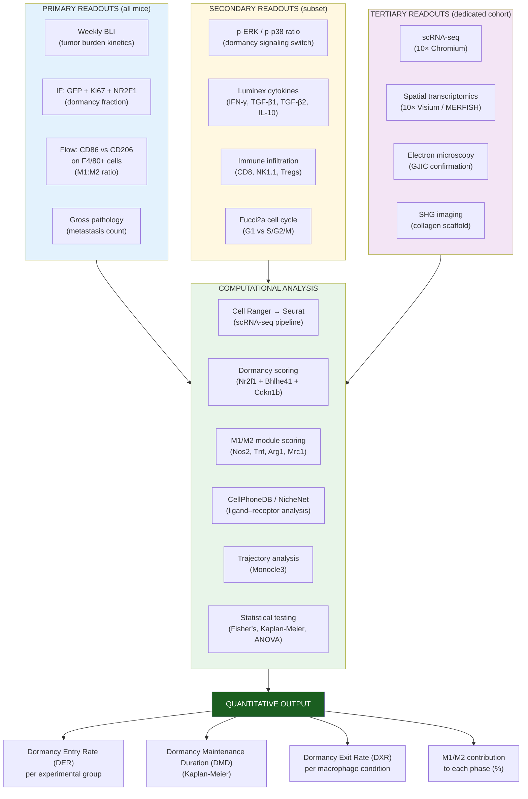
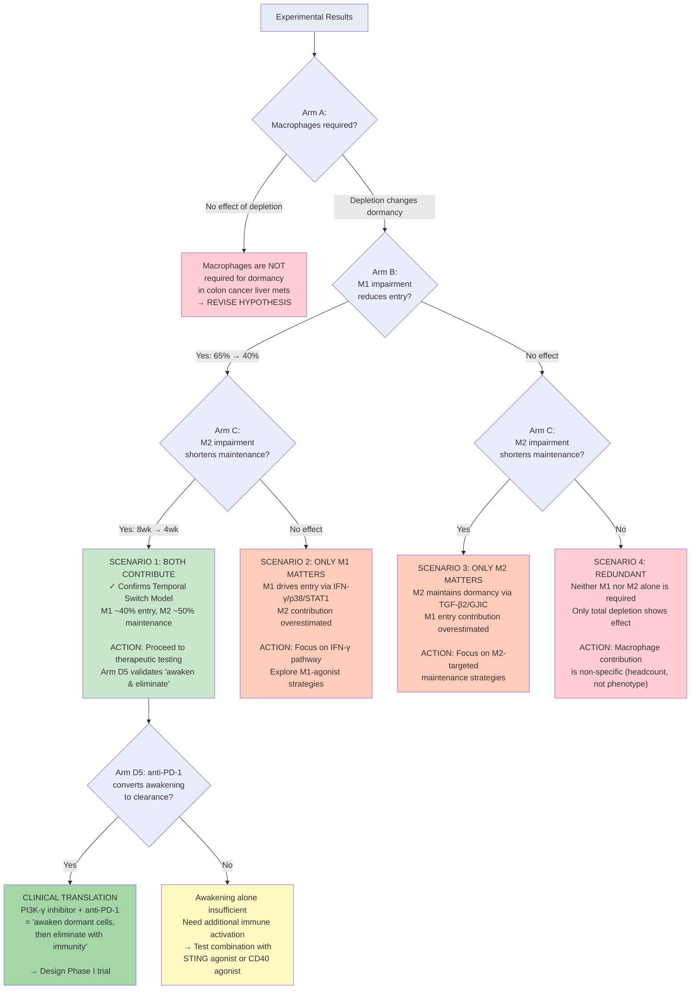
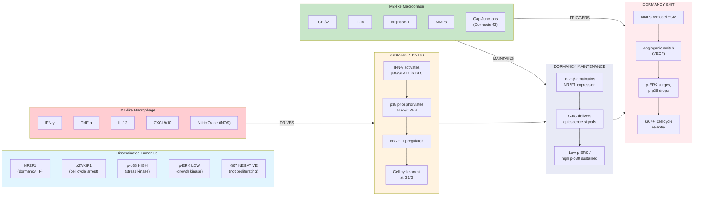
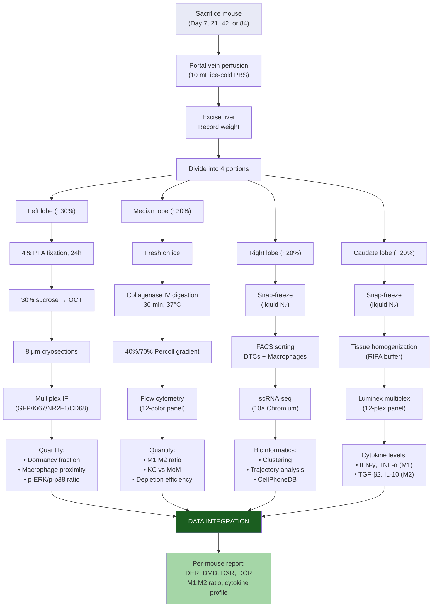
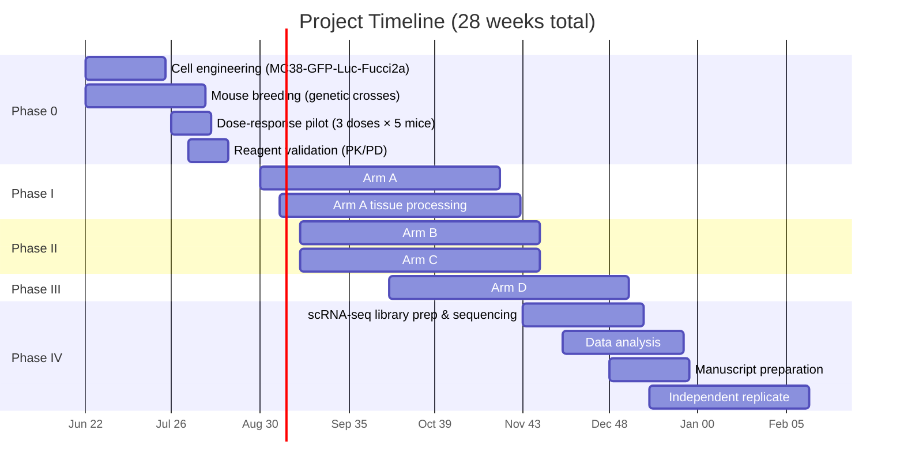

# Experimental Workflow and Expected Outcome Diagrams

## Diagram 1: Overall Project Workflow



---

## Diagram 2: Intrasplenic Injection and Dormancy Timeline



---

## Diagram 3: Four Experimental Arms

```mermaid
flowchart TB
    subgraph ArmA["ARM A: Total Macrophage Depletion"]
        direction TB
        A1["PBS liposomes<br/>(Vehicle control)"]
        A2["Clodronate liposomes<br/>from Day 1<br/>(Early depletion)"]
        A3["Clodronate liposomes<br/>from Day 14<br/>(Late depletion)"]
        A4["Clodronate +<br/>CD169-DTR + DT<br/>(Kupffer-selective)"]
    end

    subgraph ArmB["ARM B: M1 Impairment"]
        direction TB
        B1["LysM-Cre × Nos2<sup>fl/fl</sup><br/>(Genetic M1 KO)"]
        B2["LysM-Cre control"]
        B3["Nos2<sup>fl/fl</sup> no-Cre control"]
        B4["Anti-IFN-γ Ab<br/>(from Day –1)"]
        B5["Isotype control"]
        B6["Anti-IFN-γ Ab<br/>(from Day 7, late)"]
    end

    subgraph ArmC["ARM C: M2 Impairment"]
        direction TB
        C1["LysM-Cre × Arg1<sup>fl/fl</sup><br/>(Genetic M2 KO)"]
        C2["LysM-Cre control"]
        C3["Anti-IL-4Rα Ab<br/>(from Day 14)"]
        C4["Isotype control"]
        C5["CD169-DTR + DT<br/>(Kupffer depletion)"]
        C6["Cx3cr1-CreERT2 × DTA<br/>(Recruited MoM depletion)"]
    end

    subgraph ArmD["ARM D: Temporal Switch (M2→M1)"]
        direction TB
        D1["IL-4 complex Days 1–28<br/>→ IFN-γ + LPS Days 28–42"]
        D2["IL-4 complex sustained<br/>(Days 1–42)"]
        D3["IFN-γ + poly(I:C)<br/>sustained (Days 1–42)"]
        D4["PBS vehicle<br/>(Days 1–42)"]
        D5["IL-4 → IFN-γ<br/>+ anti-PD-1"]
        D6["PI3K-γ inhibitor<br/>(eganelisib, Days 28–42)"]
    end

    Question["RESEARCH QUESTION"] --> ArmA
    Question --> ArmB
    Question --> ArmC
    Question --> ArmD

    Question -.->|Are macrophages<br/>required?| ArmA
    Question -.->|Are M1 macs needed<br/>for entry?| ArmB
    Question -.->|Are M2 macs needed<br/>for maintenance?| ArmC
    Question -.->|Does M2→M1 switch<br/>trigger exit?| ArmD

    style Question fill:#1a237e,color:#ffffff
    style ArmA fill:#fff3e0
    style ArmB fill:#fce4ec
    style ArmC fill:#e8f5e9
    style ArmD fill:#f3e5f5
```



---

## Diagram 4: Readout Hierarchy and Analysis Pipeline



---

## Diagram 5: Expected Outcomes Decision Tree



---

## Diagram 6: Macrophage-DTC Interaction Model



---

## Diagram 7: Tissue Processing Pipeline at Each Timepoint



---

## Diagram 8: Budget and Timeline Summary



---

## How to Render These Diagrams

1. **Online:** Paste any diagram block into [Mermaid Live Editor](https://mermaid.live)
2. **VS Code:** Install "Mermaid Markdown Syntax Highlighting" extension
3. **GitHub:** Diagrams render natively in `.md` files with `mermaid` code blocks
4. **PDF export:** Use `mmdc` (mermaid-cli) to convert to PNG/SVG, then embed in documents:

```bash
npm install -g @mermaid-js/mermaid-cli
mmdc -i WORKFLOW_DIAGRAMS.md -o workflow_diagrams.pdf
# or individual diagrams:
mmdc -i diagram1.mmd -o diagram1.png -w 2400 -H 1600
```
